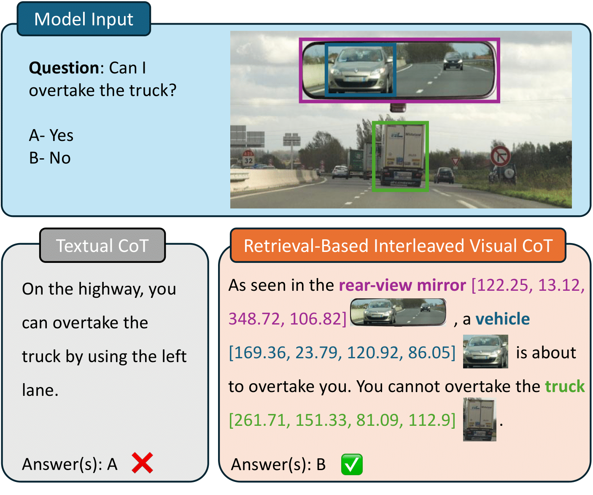

# Retrieval-Based Interleaved Visual Chain-of-Thought in Real-World Driving Scenarios

[](https://arxiv.org/abs/2501.04671)
[](https://huggingface.co/datasets/EPFL-DrivingVQA/DrivingVQA)
[](https://github.com/vita-epfl/RIV-CoT)



## Abstract

While chain-of-thought (CoT) prompting improves reasoning in large language models, its effectiveness in vision-language models (VLMs) remains limited due to over-reliance on textual cues and memorized knowledge.
To investigate the visual reasoning capabilities of VLMs in complex real-world scenarios, we introduce <span style="font-variant: small-caps;">DrivingVQA</span>, a visual question answering dataset derived from driving theory exams, which contains 3,931 multiple-choice problems with expert-written explanations and grounded entities relevant to the reasoning process.
            Leveraging this dataset, we propose <span style="font-variant: small-caps;">RIV-CoT</span>, a Retrieval-Based Interleaved Visual Chain-of-Thought
Our experiments demonstrate that <span style="font-variant: small-caps;">RIV-CoT</span> improves answer accuracy by 3.1% and reasoning accuracy by 4.6% over vanilla CoT prompting.
            Furthermore, we demonstrate that our method effectively scales to the larger A-OKVQA reasoning dataset by leveraging automatically generated pseudo-labels, outperforming CoT prompting.

## Dataset Structure

The dataset is organized into training and testing subsets with the following structure:

```
DrivingVQA/
├── train.json              # Train images, image size, questions, answers, explanation, bounding boxes
├── test.json               # Test images, image size, questions, answers, explanation, bounding boxes
├── dataset_infos.json      # Information about the dataset
├── images/                 # Images used in the dataset
```


## Benchmark

We evaluate the performance of our method, <span style="font-variant: small-caps;">RIV-CoT</span>, against answering directly the answer (DirectAnswer) and using the chain-of-thought prompting (CoT) on both <span style="font-variant: small-caps;">DringVQA</span> and AOKVQA.
        Note that, annotations of relevant entities bounding boxes are not available on AOKVQA. Therefore, we generate pseduo annotations using GPT-4o-mini to detect potential relevant entities and GoundingDINO to localize these entities within the image.
        We obtain the following exam scores for <span style="font-variant: small-caps;">DrivingVQA</span> and accuracy for AOKVQA with three different seeds:

| Method             | DrivingVQA (Exam score) | AOKVQA         |
|--------------------|--------------------------|----------------|
| DirectAnswer       | 53.0 (±0.9)              | 78.2 (±0.3)    |
| CoT                | 56.2 (±1.0)              | 80.6 (±0.4)    |
| **RIV-CoT**        | **59.3 (±1.0)**          | **84.2 (±0.2)**|


## Download

The dataset is available on [HuggingFace Hub](https://github.com/vita-epfl/helvipad/releases).


## Project Page

For more information, visualizations, and updates, visit the **[project page](https://huggingface.co/datasets/EPFL-DrivingVQA/DrivingVQA)**.

## License

This dataset is licensed under the [Creative Commons Attribution-ShareAlike 4.0 International License](http://creativecommons.org/licenses/by-sa/4.0/).

## Acknowledgments

We thank Max Luca Pio Conti, Pierre Ancey, Francesco Pettenon and Matthias Wyss for their contributions to preliminary work. We thank Auguste Poiroux, Gaston Lenczner, Florent Forest, Jacques Everwyn, Vincent Montariol, Alice Legrand, Marc Lafon, Yannis Karmim, and Alexandre Merkli for the human evaluation of the \textsc{DrivingVQA} test set. We also thank the VITA
lab members for their valuable feedback, which helped to
enhance the quality of this manuscript.
SM gratefully acknowledges the support of the Swiss National Science Foundation (No. 224881). AB gratefully acknowledges the support of the Swiss National Science Foundation (No. 215390), Innosuisse (PFFS-21-29), the EPFL Center for Imaging, Sony Group Corporation, and the Allen Institute for AI.


## Citation

If you use the Helvipad dataset in your research, please cite our paper:

```bibtex
title={DRIVINGVQA: Analyzing Visual Chain-of-Thought Reasoning of Vision Language Models in Real-World Scenarios with Driving Theory Tests},
  author={Corbi{\`e}re, Charles and Roburin, Simon and Montariol, Syrielle and Bosselut, Antoine and Alahi, Alexandre},
  journal={arXiv preprint arXiv:2501.04671},
  year={2025}
}
```
